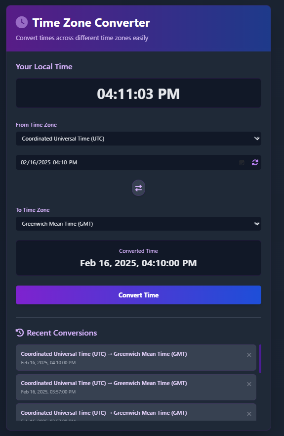

# Time Zone Converter

A sleek, interactive web application for converting times between different time zones with a modern dark theme UI.



## Features

- **Timezone Selection:** Convert between popular timezones (GMT, EAT, EST, etc.)
- **Real-time Local Clock:** Displays your current local time
- **Interactive Dark UI:** Modern design with responsive layout
- **Animation Effects:** Smooth transitions, fades, and interactive elements
- **Conversion History:** Tracks and saves your recent conversions
- **Swap Function:** Easily swap source and target timezones
- **Auto-detect:** Automatically detects user's timezone
- **Mobile Responsive:** Works on all device sizes

## Technologies Used

- HTML5
- CSS3 with custom animations
- JavaScript (ES6+)
- Tailwind CSS for styling
- Font Awesome for icons
- Local Storage API for saving history

## Installation

1. Clone the repository:
   ```
   git clone https://github.com/qharny/time-zone-converter.git
   ```

2. Navigate to the project directory:
   ```
   cd time-zone-converter
   ```

3. Open `index.html` in your browser

Alternatively, you can simply download the ZIP file and extract it to your desired location.

## Usage

1. Your local time is displayed at the top
2. Select your source timezone from the dropdown
3. Enter the date and time you want to convert
4. Select the target timezone
5. The converted time appears instantly
6. View your conversion history at the bottom
7. Click on any history item to reload that conversion

### Quick Tips:
- Click the refresh icon to set the input to current time
- Use the swap button to quickly switch source and target timezones
- Delete individual history items by clicking the (×) button

## File Structure

```
time-zone-converter/
│
├── index.html          # Main HTML file
├── Style/style.css           # CSS styles and animations
├── JS/script.js           # JavaScript functionality
└── README.md           # This file
```

## Browser Compatibility

- Chrome (latest)
- Firefox (latest)
- Safari (latest)
- Edge (latest)
- Opera (latest)

## Future Enhancements

- [ ] Add more timezone options
- [ ] Implement day/night indicators
- [ ] Add world map visualization
- [ ] Export/import history
- [ ] Multiple time comparisons
- [ ] Custom theme options

## Contributing

1. Fork the repository
2. Create your feature branch (`git checkout -b feature/amazing-feature`)
3. Commit your changes (`git commit -m 'Add some amazing feature'`)
4. Push to the branch (`git push origin feature/amazing-feature`)
5. Open a Pull Request

## License

This project is licensed under the MIT License - see the LICENSE file for details.

## Acknowledgements

- [Intl.DateTimeFormat](https://developer.mozilla.org/en-US/docs/Web/JavaScript/Reference/Global_Objects/Intl/DateTimeFormat) for timezone conversion
- [Tailwind CSS](https://tailwindcss.com/) for styling
- [Font Awesome](https://fontawesome.com/) for icons# Time Zone Converter

A sleek, interactive web application for converting times between different time zones with a modern dark theme UI.

<!--  -->

## Features

- **Timezone Selection:** Convert between popular timezones (GMT, EAT, EST, etc.)
- **Real-time Local Clock:** Displays your current local time
- **Interactive Dark UI:** Modern design with responsive layout
- **Animation Effects:** Smooth transitions, fades, and interactive elements
- **Conversion History:** Tracks and saves your recent conversions
- **Swap Function:** Easily swap source and target timezones
- **Auto-detect:** Automatically detects user's timezone
- **Mobile Responsive:** Works on all device sizes

## Technologies Used

- HTML5
- CSS3 with custom animations
- JavaScript (ES6+)
- Tailwind CSS for styling
- Font Awesome for icons
- Local Storage API for saving history

## Installation

1. Clone the repository:
   ```
   git clone https://github.com/yourusername/time-zone-converter.git
   ```

2. Navigate to the project directory:
   ```
   cd time-zone-converter
   ```

3. Open `index.html` in your browser

Alternatively, you can simply download the ZIP file and extract it to your desired location.

## Usage

1. Your local time is displayed at the top
2. Select your source timezone from the dropdown
3. Enter the date and time you want to convert
4. Select the target timezone
5. The converted time appears instantly
6. View your conversion history at the bottom
7. Click on any history item to reload that conversion

### Quick Tips:
- Click the refresh icon to set the input to current time
- Use the swap button to quickly switch source and target timezones
- Delete individual history items by clicking the (×) button

## File Structure

```
time-zone-converter/
│
├── index.html          # Main HTML file
├── style.css           # CSS styles and animations
├── script.js           # JavaScript functionality
└── README.md           # This file
```

## Browser Compatibility

- Chrome (latest)
- Firefox (latest)
- Safari (latest)
- Edge (latest)
- Opera (latest)

## Future Enhancements

- [ ] Add more timezone options
- [ ] Implement day/night indicators
- [ ] Add world map visualization
- [ ] Export/import history
- [ ] Multiple time comparisons
- [ ] Custom theme options

## Contributing

1. Fork the repository
2. Create your feature branch (`git checkout -b feature/amazing-feature`)
3. Commit your changes (`git commit -m 'Add some amazing feature'`)
4. Push to the branch (`git push origin feature/amazing-feature`)
5. Open a Pull Request

## License

This project is licensed under the MIT License - see the LICENSE file for details.

## Acknowledgements

- [Intl.DateTimeFormat](https://developer.mozilla.org/en-US/docs/Web/JavaScript/Reference/Global_Objects/Intl/DateTimeFormat) for timezone conversion
- [Tailwind CSS](https://tailwindcss.com/) for styling
- [Font Awesome](https://fontawesome.com/) for icons